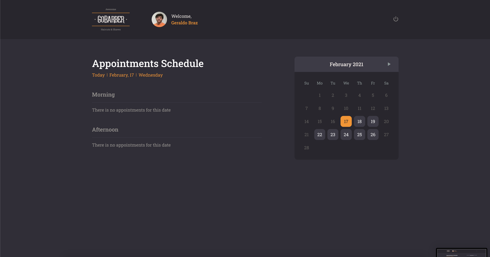
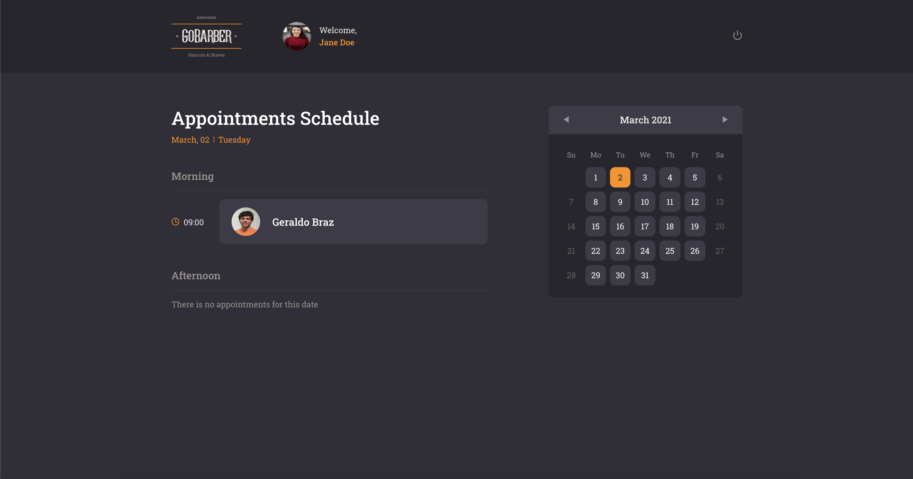

# Go Barber
<h1 align="center"></h1>

<div align="center">

     

   [Backend](#Backend) | [Frontend](#Frontend) | [Mobile](#Mobile)

</div>

<p align="center">
    
</p>

## 🚀 Getting Started

### 🚨 Prerequisites
#### 🐳 Configure databases using docker

1. Create the required containers
    ```
    docker run --name postegres -e POSTGRES_PASSWORD=docker -p 5432:5432 -d postgres
    docker run --name mongo -p 27017:27017 -d -t mongo
    docker run --name redis -p 6379:6379 -d -t redis:alpine
    ```
2. Create a postgres databse (I used DBeaver) and then run the migrations
    ```
    yarn dev:server
    ```
3. Start the containers before starting the backend
    ```
    docker start <container_id>
    ```


#### 📥 Installing dependencies
Inside the project's folder, run:

```
yarn
```

### Backend
### 🏎 Running application
```
yarn dev:server
```

### Frontend
### 🏎 Running application
```
yarn start
```

### Mobile
### 🏎 Running application
```
yarn ios
```
or
```
yarn android
```

### 📷 Screens
<p align="center">
    
    
    
    
</p>

## 🛠 Built With

* [Node](https://nodejs.org/) - JavaScript runtime environment
* [ReactJs](https://reactjs.org/) - A declarative, efficient, and flexible JavaScript library for building user interfaces.
* [Yarn](https://yarnpkg.com/) - Package Manager
* [Express](https://expressjs.com/) - Web framework used NodeJS
* [TypeScript](https://www.typescriptlang.org/) - Typed Superset of JavaScript - used as a development dependency
* [Docker](https://www.docker.com/) - Complete environments in containers

## 🎖 Author
* **Geraldo Braz** - *Initial work* - [@geraldobraz](https://github.com/geraldobraz)

## 📝 License

This project is licensed under the MIT License - see the [LICENSE.md](LICENSE.md) file for details
